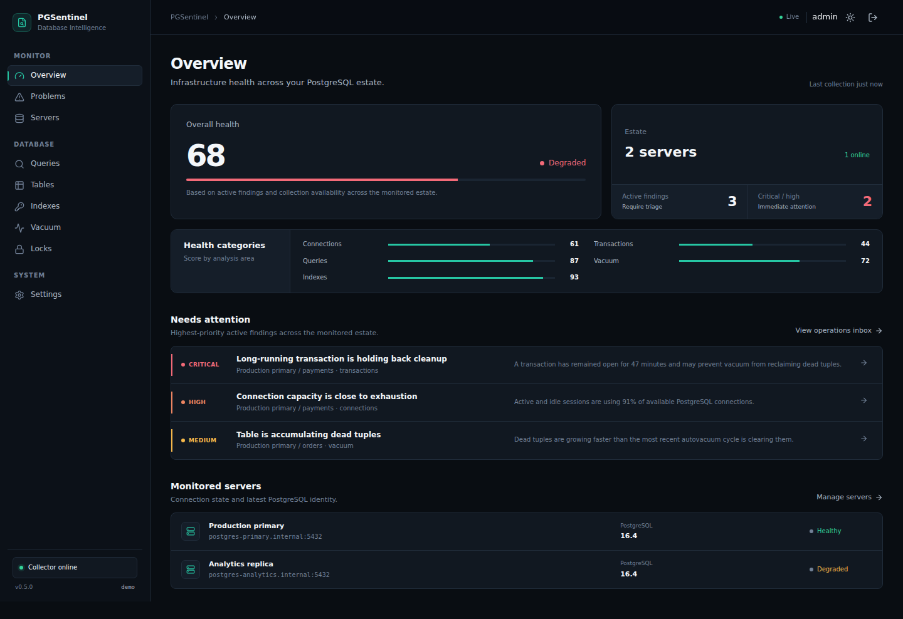
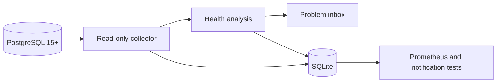
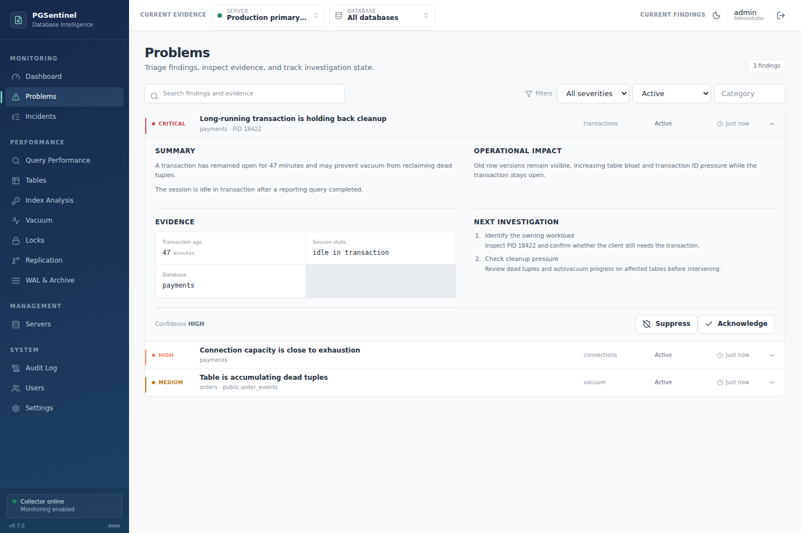

# PGSentinel

**PostgreSQL health intelligence for operators who need answers, not another wall of graphs.**

PGSentinel turns PostgreSQL telemetry into an operations inbox: what is wrong, how severe it is, the evidence behind it, why it matters, and what to investigate next. It is self-hosted, read-only toward monitored databases, and built for PostgreSQL 15+.

[](https://github.com/matta813/PGSentinel/actions/workflows/ci.yml)
[](https://github.com/matta813/PGSentinel/releases)
[](https://scorecard.dev/viewer/?uri=github.com/matta813/PGSentinel)
[](LICENSE)



[Quick start](#30-second-quick-start) · [Documentation](docs/README.md) · [Releases](https://github.com/matta813/PGSentinel/releases) · [Discussions](https://github.com/matta813/PGSentinel/discussions)

> PGSentinel is an early usable release. Validate every recommendation against your workload and recovery plan before acting in production.

## Why PGSentinel?

Traditional monitoring is good at answering “what changed?” with dashboards and time series. During an incident, operators still have to connect those signals to a likely problem.

PGSentinel adds an evidence-driven analysis layer:

```text
Problem → severity → evidence → operational impact → next investigation
```

Findings keep a stable identity and move through active, acknowledged, resolved, and reopened states. PGSentinel does not automatically change database configuration, terminate sessions, drop indexes, or run `EXPLAIN ANALYZE`.

## 30-second quick start

With Docker and the Compose v2 plugin installed:

```bash
curl -fsSL https://raw.githubusercontent.com/matta813/PGSentinel/main/scripts/install-compose.sh | sh
```

The installer downloads the pinned Compose definition, generates unique local secrets, starts the published container, and prints the one-time bootstrap password. Then:

1. Open <http://localhost:8080>.
2. Sign in as `admin` and replace the bootstrap password.
3. Add a PostgreSQL target under **Servers**.
4. Let the first collection cycle populate the operations inbox.

Prefer to inspect scripts before running them? Follow the [review-first installation path](docs/deployment.md#start-with-docker-compose). The stack starts only PGSentinel; it never provisions or modifies PostgreSQL. Keep the generated `pgsentinel/.env` private and backed up—without its encryption key, saved database credentials cannot be recovered.

## Capabilities

### Health intelligence

- Weighted server and category health scores
- Evidence-driven findings with severity and confidence
- Stable problem lifecycle: active, acknowledged, resolved, and reopened
- Cautious investigation guidance; no automatic destructive action

### PostgreSQL visibility

- Connections, transactions, databases, locks, tables, vacuum, indexes, and configuration
- Role-aware replication, WAL retention, and checkpoint-pressure findings
- Per-database table and index collection across a configurable number of databases
- `pg_stat_statements` query load and multi-factor Query Impact Score
- Duplicate and potentially unused index candidates with supporting evidence

### Operations

- Multiple PostgreSQL targets, tags, SSL modes, and connection diagnostics
- Searchable operations inbox and 30-day raw snapshot retention by default
- Encrypted ntfy and generic webhook destinations with delivery tests
- Dedupe-safe notifications for new, escalated, reopened, and resolved High/Critical findings
- Low-cardinality Prometheus metrics plus health and readiness endpoints

### Security and deployment

- AES-256-GCM encrypted target credentials and Argon2id administrator passwords
- Single-container deployment with a non-root user, read-only root filesystem, and dropped capabilities
- SSRF-aware notification delivery and explicit private-target allowlisting
- GitHub Actions CI, CodeQL, dependency review, vulnerability scanning, and automated releases

## How it works



The Go service schedules read-only collection through `pgx`, persists snapshots and finding state in SQLite, runs deterministic analyzer rules, serves the React application, and exposes versioned operational APIs. See the [architecture guide](docs/architecture.md) for the exact data flow and security boundaries.

## Product tour

### An operations inbox with the reasoning attached



Each finding keeps the context needed for triage in one place instead of sending the operator across unrelated charts. The interface also includes query impact, table health, index analysis, vacuum progress, blocking locks, server management, and light/dark themes.

The screenshots use synthetic demo data. Maintainers can reproduce them with the [documented screenshot workflow](docs/assets/README.md).

## PostgreSQL setup

Create a dedicated login and grant PostgreSQL's built-in monitoring role:

```sql
CREATE ROLE pgsentinel LOGIN PASSWORD 'use-a-strong-secret';
GRANT pg_monitor TO pgsentinel;
```

Allow only the PGSentinel source address in `pg_hba.conf` and prefer verified TLS across networks. Query analysis additionally requires `pg_stat_statements`; PGSentinel detects and explains when it is unavailable. The [monitoring user guide](docs/monitoring-user.md) covers privileges, TLS, and extension setup.

## Deployment

The published container stores configuration, encrypted credentials, snapshots, users, and findings under `/data`. Production deployments should pin a release version, protect the encryption key in a secret store, back up SQLite consistently, publish the UI only to a trusted management network, and enable secure cookies behind HTTPS.

- [Compose installation, upgrades, backups, and hardening](docs/deployment.md)
- [Release images and upgrade process](docs/releases.md)
- [Latest GitHub release](https://github.com/matta813/PGSentinel/releases/latest)

## Documentation

| Goal | Guide |
|---|---|
| Install or operate PGSentinel | [Deployment](docs/deployment.md) |
| Create a safe PostgreSQL login | [Monitoring user](docs/monitoring-user.md) |
| Understand findings and scores | [Health rules](docs/health-rules.md) |
| Understand components and data flow | [Architecture](docs/architecture.md) |
| Build and test locally | [Development](docs/development.md) |
| Publish or consume releases | [Releases](docs/releases.md) |
| See current priorities | [Roadmap](ROADMAP.md) |

The [documentation index](docs/README.md) is the complete entry point. Current limitations and planned work are kept in the [roadmap](ROADMAP.md), rather than presented as shipped behavior.

## Community

- Ask usage and design questions in [GitHub Discussions](https://github.com/matta813/PGSentinel/discussions).
- Report reproducible bugs or request features with the [issue templates](https://github.com/matta813/PGSentinel/issues/new/choose).
- Read [CONTRIBUTING.md](CONTRIBUTING.md) before starting a change.
- Follow the [Code of Conduct](CODE_OF_CONDUCT.md) and [governance model](GOVERNANCE.md).
- Report vulnerabilities privately according to [SECURITY.md](SECURITY.md), never in a public issue.

If PGSentinel is useful in your PostgreSQL environment, consider [starring the repository](https://github.com/matta813/PGSentinel). It helps other PostgreSQL operators discover the project.

## License

PGSentinel is available under the [MIT License](LICENSE).
