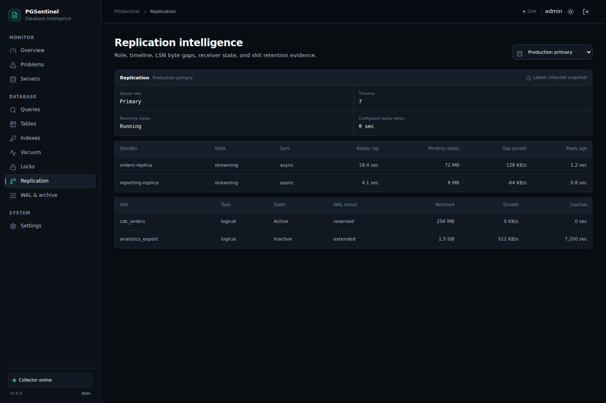

# Health rules and scores

Every finding carries severity, confidence, evidence, likely cause, impact and a suggested investigation. Thresholds are defaults—not universal tuning truth. Current rules cover connection pressure, idle/open transactions, blockers, rollback and cache ratios, deadlocks, dead tuples, autovacuum trigger progress, large-table sequential scans, stale analyze data, high query impact, query regressions, replication state and lag, inactive slots retaining WAL, checkpoint pressure, unused/duplicate index candidates, missing `pg_stat_statements`, and disabled I/O timing.

Severity deductions are deterministic: INFO 0, LOW 2, MEDIUM 6, HIGH 15, CRITICAL 35. The overall and relevant category score start at 100 and floor at zero. Thus one critical issue cannot be obscured by many informational findings. Category keys are Performance, Vacuum, Queries, Connections, Indexes, Configuration, Replication and WAL.

Query Impact Score uses logarithmically scaled components: total execution time 35%, mean latency 20%, shared block reads 20%, temporary block IO 15%, and WAL bytes 10%. This deliberately differentiates `1 ms × 20,000,000 calls` from `4 sec × 3 calls`; cumulative work can have greater capacity impact. It is a ranking signal, not a percentage or proof of causality.

Query regression analysis compares interval deltas rather than cumulative `pg_stat_statements` means. It requires six compatible baseline intervals with at least 20 calls each, a current interval with at least 20 calls and one second of total execution time, a baseline median of at least 5 ms, and both a 75% increase and a three-median-absolute-deviation anomaly. Counter decreases, resets, eviction, and missing query IDs exclude incompatible intervals. The rule does not run `EXPLAIN` and favors fewer high-confidence findings over weak alerts.

Replication rules are role-aware. A recovery server is checked for a running, streaming WAL receiver and visibly paused replay; a primary is checked only for standbys it can actually observe in `pg_stat_replication`. PGSentinel does not assume a primary should have a replica when PostgreSQL exposes no evidence of that intent. Replay findings include time lag, send/write/flush/replay byte gaps, reply age, sync mode, and gap growth where a compatible prior sample exists. Replay lag becomes Medium at 60 seconds.

Set the monitored standby tag `delayed-replica` when its local `recovery_min_apply_delay` expresses intentional delay. When assessing standbys visible only from a primary, tag that primary `allow-delayed-replicas` if elevated replay delay is an accepted property of its topology. These tags suppress the generic replay-lag rule but do not hide disconnected receivers, non-streaming state, lost slots, or archive failures.

An inactive replication slot becomes High when it retains at least 1 GiB of WAL; evidence includes slot type, WAL status, inactivity age on PostgreSQL 17+, and retention growth. A slot with `wal_status=lost` is Critical because its consumer cannot continue from the retained position. Operators should verify slot ownership and consumer recovery procedures; PGSentinel never drops or advances a slot.

Archive analysis reports enabled archiving without an archive destination and a latest failed attempt that has no later success. It intentionally does not infer backlog from cumulative failures alone or expose `archive_command`, `archive_library`, or their arguments. PostgreSQL does not expose a portable archive queue length through its statistics views.

Checkpoint analysis on primaries waits for at least ten observed checkpoints. It reports requested-checkpoint pressure when requested checkpoints are at least 20% of the total, and frequent checkpoints when their average interval since statistics reset is below five minutes. PostgreSQL 15–16 use `pg_stat_bgwriter`; PostgreSQL 17+ use `pg_stat_checkpointer`. PostgreSQL 17+ standbys use the separate attempted and completed restartpoint counters. PGSentinel does not assign a restartpoint finding on PostgreSQL 15–16 because those releases do not expose the separate counters needed for the same confidence.

If an optional collector section fails, PGSentinel preserves its last complete snapshot and does not resolve findings from incomplete evidence. The server becomes `degraded`, the estate score is capped at 75, and the UI distinguishes that state from healthy. A failed core collection becomes `error`; an unreachable target becomes `unreachable`, and the score is capped at 50. Cached evidence may therefore be older than the latest successful connection and should be interpreted with the displayed collection state.

Unused indexes require zero observed scans, non-constraint status and at least 100 MiB. Scan counters reset and observation length matters; confidence is therefore Medium. Duplicate detection matches indexed columns, included columns and predicate, but operators, constraints and workload must still be checked. pgsentinel never drops an index.
