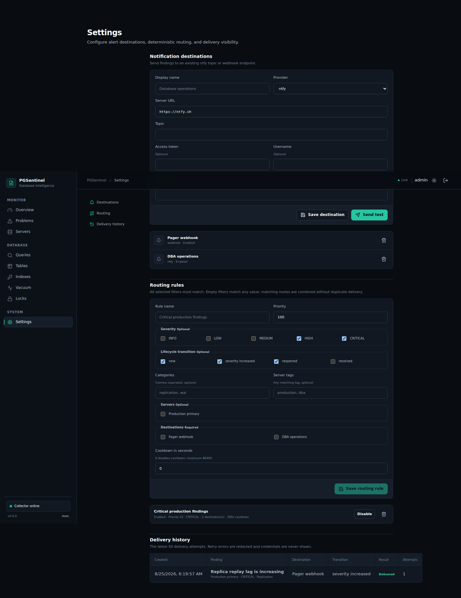

# Notification routing

PGSentinel can deliver finding lifecycle events to encrypted ntfy and generic webhook destinations. Delivery is asynchronous and never blocks PostgreSQL collection or analysis.

## Default behavior

Before the first routing rule is created, every enabled destination receives new, severity-increased, reopened, and resolved events for High and Critical findings. This preserves the behavior of existing 0.6.0 installations.

After any routing rule is created, explicit routing takes over. A finding that matches no enabled rule is not delivered. Deleting all rules restores the default behavior.

## Rule matching

Create rules under **Settings → Routing**. A rule can filter by:

- severity;
- finding category;
- server;
- any matching server tag;
- lifecycle transition (`new`, `severity_increased`, `reopened`, or `resolved`).

Every configured filter in one rule must match. An empty filter matches any value. Categories and tags are case-insensitive. Rules are evaluated in priority and stable ID order; all matching destinations are combined, so overlapping rules cannot send the same event twice to one destination. A rule can select up to 20 destinations.

Lower-severity events can be delivered only through an explicit matching route. This makes the default quiet while allowing deliberate informational routing.

## Cooldowns and retries

A cooldown suppresses a new event for the same finding and destination when a successful delivery occurred within the configured interval. A cooldown may be zero to 86,400 seconds. If overlapping rules specify different cooldowns, the least restrictive matching cooldown wins. Suppressed events remain visible in delivery history with a `cooldown` result.

Failed deliveries are retried at most three times with a bounded delay. The delivery history shows pending, retry, failed, delivered, and cooldown results, the attempt count, the next retry where applicable, and the last safe error. URLs are redacted from persisted and logged failures. Destination credentials and decrypted configuration are never returned by these APIs.

History is bounded to the latest 2,000 destination events. The UI shows the latest 50. The API accepts `limit` from 1 to 200 and a non-negative `offset`.

## API

- `GET|POST /api/v1/notification-routes`
- `PUT|DELETE /api/v1/notification-routes/{id}`
- `GET /api/v1/notification-deliveries?limit=50&offset=0`

All endpoints require an authenticated session. Route requests reject unknown fields, invalid UUID references, unsupported severities or transitions, disabled destinations, excessive filter sizes, and cooldowns outside the safe range.

## Upgrade and rollback

Migration `004_notification_routing.sql` adds routing tables and delivery-state columns without rewriting existing notification events. Existing installations retain their prior default fan-out until a rule is created. SQLite migrations are forward-only; roll back the application only with a database backup taken before the upgrade.
